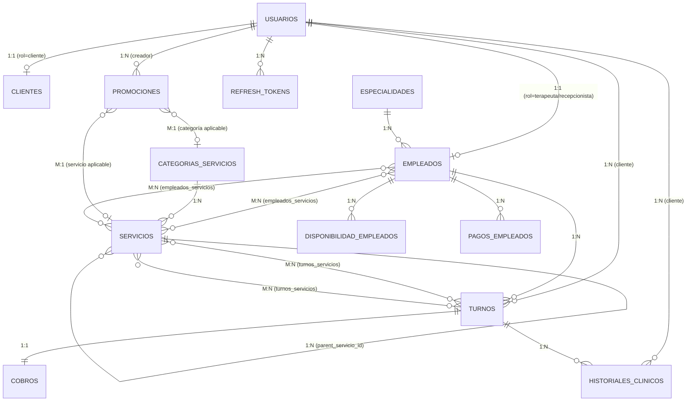

# Documento para Experto en Base de Datos - Proyecto SpaGrace

---

## STACK Y VERSIONES ACTUALES

| Tecnología | Versión | Notas |
|-----------|---------|-------|
| Node.js | 24.18.0 | Runtime |
| MySQL | 8.4+ / MariaDB 11.4+ | Motor de BD |
| TypeORM | 1.1.0 | ORM (versión 1.0 estable) |
| mysql2 | 3.23.1 | Driver MySQL para Node |

---

## ESQUEMA DE BASE DE DATOS COMPLETO

### Base de datos: `spa_consultorio_db`

### Charset: `utf8mb4` | Collation: `utf8mb4_general_ci`

---

## 15 TABLAS PRINCIPALES

```sql
-- =============================================
-- CREACIÓN DE BASE DE DATOS
-- =============================================
DROP DATABASE IF EXISTS spa_consultorio_db;
CREATE DATABASE spa_consultorio_db
  CHARACTER SET utf8mb4
  COLLATE utf8mb4_general_ci;

USE spa_consultorio_db;
```

### 1. `usuarios` - Cuentas de acceso al sistema

```sql
CREATE TABLE `usuarios` (
  `id` INT AUTO_INCREMENT PRIMARY KEY,
  `nombre` VARCHAR(100) NOT NULL,
  `email` VARCHAR(100) NOT NULL UNIQUE,
  `username` VARCHAR(50) DEFAULT NULL UNIQUE,
  `password` VARCHAR(255) NOT NULL,
  `rol` ENUM('admin','recepcionista','terapeuta','cliente') NOT NULL DEFAULT 'cliente',
  `telefono` VARCHAR(20) DEFAULT NULL,
  `fecha_nacimiento` DATE DEFAULT NULL,
  `sexo` ENUM('Masculino','Femenino','Otro') DEFAULT NULL,
  `avatar_url` VARCHAR(255) DEFAULT NULL,
  `fecha_registro` TIMESTAMP NOT NULL DEFAULT CURRENT_TIMESTAMP,
  `created_at` TIMESTAMP NOT NULL DEFAULT CURRENT_TIMESTAMP,
  `updated_at` TIMESTAMP NOT NULL DEFAULT CURRENT_TIMESTAMP ON UPDATE CURRENT_TIMESTAMP,
  `deleted_at` TIMESTAMP NULL DEFAULT NULL
) ENGINE=InnoDB DEFAULT CHARSET=utf8mb4;

-- Índices adicionales
CREATE INDEX `idx_usuarios_rol` ON `usuarios` (`rol`);
CREATE INDEX `idx_usuarios_email` ON `usuarios` (`email`);
CREATE INDEX `idx_usuarios_deleted` ON `usuarios` (`deleted_at`);
```

### 2. `clientes` - Ficha extendida de clientes

```sql
CREATE TABLE `clientes` (
  `id` INT AUTO_INCREMENT PRIMARY KEY,
  `id_usuario` INT NOT NULL UNIQUE,
  `direccion` VARCHAR(255) DEFAULT NULL,
  `ocupacion` VARCHAR(100) DEFAULT NULL,
  `como_conocio` VARCHAR(100) DEFAULT NULL,
  `alergias` TEXT DEFAULT NULL,
  `notas_internas` TEXT DEFAULT NULL,
  `created_at` TIMESTAMP NOT NULL DEFAULT CURRENT_TIMESTAMP,
  `updated_at` TIMESTAMP NOT NULL DEFAULT CURRENT_TIMESTAMP ON UPDATE CURRENT_TIMESTAMP,
  FOREIGN KEY (`id_usuario`) REFERENCES `usuarios` (`id`) ON DELETE CASCADE
) ENGINE=InnoDB DEFAULT CHARSET=utf8mb4;
```

### 3. `especialidades` - Catálogo de especialidades

```sql
CREATE TABLE `especialidades` (
  `id` INT AUTO_INCREMENT PRIMARY KEY,
  `nombre` VARCHAR(100) NOT NULL UNIQUE,
  `descripcion` TEXT DEFAULT NULL,
  `activo` TINYINT(1) NOT NULL DEFAULT 1,
  `created_at` TIMESTAMP NOT NULL DEFAULT CURRENT_TIMESTAMP,
  `updated_at` TIMESTAMP NOT NULL DEFAULT CURRENT_TIMESTAMP ON UPDATE CURRENT_TIMESTAMP
) ENGINE=InnoDB DEFAULT CHARSET=utf8mb4;
```

### 4. `empleados` - Perfil laboral (1:1 con usuario)

```sql
CREATE TABLE `empleados` (
  `id` INT AUTO_INCREMENT PRIMARY KEY,
  `id_usuario` INT NOT NULL UNIQUE,
  `id_especialidad` INT DEFAULT NULL,
  `activo` TINYINT(1) NOT NULL DEFAULT 1,
  `created_at` TIMESTAMP NOT NULL DEFAULT CURRENT_TIMESTAMP,
  `updated_at` TIMESTAMP NOT NULL DEFAULT CURRENT_TIMESTAMP ON UPDATE CURRENT_TIMESTAMP,
  `deleted_at` TIMESTAMP NULL DEFAULT NULL,
  FOREIGN KEY (`id_usuario`) REFERENCES `usuarios` (`id`) ON DELETE CASCADE,
  FOREIGN KEY (`id_especialidad`) REFERENCES `especialidades` (`id`) ON DELETE SET NULL,
  INDEX `idx_empleados_activo` (`activo`),
  INDEX `idx_empleados_especialidad` (`id_especialidad`)
) ENGINE=InnoDB DEFAULT CHARSET=utf8mb4;
```

### 5. `categorias_servicios` - Categorías de servicios

```sql
CREATE TABLE `categorias_servicios` (
  `id` INT AUTO_INCREMENT PRIMARY KEY,
  `nombre` VARCHAR(100) NOT NULL UNIQUE,
  `descripcion` TEXT DEFAULT NULL,
  `icono` VARCHAR(50) DEFAULT NULL,
  `orden` INT NOT NULL DEFAULT 0,
  `activo` TINYINT(1) NOT NULL DEFAULT 1,
  `created_at` TIMESTAMP NOT NULL DEFAULT CURRENT_TIMESTAMP,
  `updated_at` TIMESTAMP NOT NULL DEFAULT CURRENT_TIMESTAMP ON UPDATE CURRENT_TIMESTAMP
) ENGINE=InnoDB DEFAULT CHARSET=utf8mb4;
```

### 6. `servicios` - Catálogo jerárquico (self-referencing)

```sql
CREATE TABLE `servicios` (
  `id` INT AUTO_INCREMENT PRIMARY KEY,
  `id_categoria` INT DEFAULT NULL,
  `nombre` VARCHAR(100) NOT NULL,
  `descripcion` TEXT DEFAULT NULL,
  `duracion` INT NOT NULL COMMENT 'Duración en minutos',
  `precio` DECIMAL(10,2) NOT NULL,
  `tipo` ENUM('principal','addon') NOT NULL DEFAULT 'principal',
  `parent_servicio_id` INT DEFAULT NULL COMMENT 'FK auto-referenciada para add-ons',
  `imagen_url` VARCHAR(255) DEFAULT NULL,
  `activo` TINYINT(1) NOT NULL DEFAULT 1,
  `created_at` TIMESTAMP NOT NULL DEFAULT CURRENT_TIMESTAMP,
  `updated_at` TIMESTAMP NOT NULL DEFAULT CURRENT_TIMESTAMP ON UPDATE CURRENT_TIMESTAMP,
  `deleted_at` TIMESTAMP NULL DEFAULT NULL,
  FOREIGN KEY (`id_categoria`) REFERENCES `categorias_servicios` (`id`) ON DELETE SET NULL,
  FOREIGN KEY (`parent_servicio_id`) REFERENCES `servicios` (`id`) ON DELETE SET NULL,
  INDEX `idx_servicios_categoria` (`id_categoria`),
  INDEX `idx_servicios_tipo` (`tipo`),
  INDEX `idx_servicios_parent` (`parent_servicio_id`)
) ENGINE=InnoDB DEFAULT CHARSET=utf8mb4;
```

### 7. `empleados_servicios` - Pivote M:N Empleado-Servicio

```sql
CREATE TABLE `empleados_servicios` (
  `id_empleado` INT NOT NULL,
  `id_servicio` INT NOT NULL,
  PRIMARY KEY (`id_empleado`, `id_servicio`),
  FOREIGN KEY (`id_empleado`) REFERENCES `empleados` (`id`) ON DELETE CASCADE,
  FOREIGN KEY (`id_servicio`) REFERENCES `servicios` (`id`) ON DELETE CASCADE
) ENGINE=InnoDB DEFAULT CHARSET=utf8mb4;
```

### 8. `turnos` - Reservas de citas

```sql
CREATE TABLE `turnos` (
  `id` INT AUTO_INCREMENT PRIMARY KEY,
  `id_cliente` INT NOT NULL,
  `id_empleado` INT NOT NULL,
  `fecha` DATE NOT NULL,
  `hora` TIME NOT NULL,
  `duracion_total` INT NOT NULL COMMENT 'Minutos totales (suma de servicios del paquete)',
  `precio_total` DECIMAL(10,2) NOT NULL COMMENT 'Suma de precios de servicios',
  `estado` ENUM('pendiente','confirmado','cancelado','atendido','ausente','reprogramado') NOT NULL DEFAULT 'pendiente',
  `notas_turno` TEXT DEFAULT NULL,
  `fecha_creacion` TIMESTAMP NOT NULL DEFAULT CURRENT_TIMESTAMP,
  `created_at` TIMESTAMP NOT NULL DEFAULT CURRENT_TIMESTAMP,
  `updated_at` TIMESTAMP NOT NULL DEFAULT CURRENT_TIMESTAMP ON UPDATE CURRENT_TIMESTAMP,
  `deleted_at` TIMESTAMP NULL DEFAULT NULL,
  FOREIGN KEY (`id_cliente`) REFERENCES `usuarios` (`id`) ON DELETE CASCADE,
  FOREIGN KEY (`id_empleado`) REFERENCES `empleados` (`id`) ON DELETE CASCADE,
  INDEX `idx_turnos_fecha` (`fecha`),
  INDEX `idx_turnos_estado` (`estado`),
  INDEX `idx_turnos_empleado_fecha` (`id_empleado`, `fecha`),
  INDEX `idx_turnos_cliente_fecha` (`id_cliente`, `fecha`),
  INDEX `idx_turnos_deleted` (`deleted_at`)
) ENGINE=InnoDB DEFAULT CHARSET=utf8mb4;
```

### 9. `turnos_servicios` - Pivote M:N Turno-Servicio

```sql
CREATE TABLE `turnos_servicios` (
  `id_turno` INT NOT NULL,
  `id_servicio` INT NOT NULL,
  `precio_servicio` DECIMAL(10,2) NOT NULL COMMENT 'Precio congelado al momento de agendar',
  PRIMARY KEY (`id_turno`, `id_servicio`),
  FOREIGN KEY (`id_turno`) REFERENCES `turnos` (`id`) ON DELETE CASCADE,
  FOREIGN KEY (`id_servicio`) REFERENCES `servicios` (`id`) ON DELETE CASCADE
) ENGINE=InnoDB DEFAULT CHARSET=utf8mb4;
```

### 10. `cobros` - Registro financiero (1:1 con turno)

```sql
CREATE TABLE `cobros` (
  `id` INT AUTO_INCREMENT PRIMARY KEY,
  `id_turno` INT NOT NULL UNIQUE,
  `monto_total` DECIMAL(10,2) NOT NULL,
  `monto_adelanto` DECIMAL(10,2) DEFAULT 0.00,
  `monto_pendiente` DECIMAL(10,2) GENERATED ALWAYS AS (`monto_total` - `monto_adelanto`) STORED,
  `metodo_pago_adelanto` VARCHAR(50) DEFAULT NULL,
  `metodo_pago_final` VARCHAR(50) DEFAULT NULL,
  `fecha_adelanto` DATETIME DEFAULT NULL,
  `fecha_cobro_final` DATETIME DEFAULT NULL,
  `estado_pago` ENUM('pendiente_adelanto','adelanto_pagado','pagado_completo','cancelado','reembolsado') NOT NULL DEFAULT 'pendiente_adelanto',
  `promocion_aplicada` VARCHAR(50) DEFAULT NULL COMMENT 'Código de descuento utilizado',
  `notas` TEXT DEFAULT NULL,
  `created_at` TIMESTAMP NOT NULL DEFAULT CURRENT_TIMESTAMP,
  `updated_at` TIMESTAMP NOT NULL DEFAULT CURRENT_TIMESTAMP ON UPDATE CURRENT_TIMESTAMP,
  FOREIGN KEY (`id_turno`) REFERENCES `turnos` (`id`) ON DELETE CASCADE,
  INDEX `idx_cobros_estado` (`estado_pago`),
  INDEX `idx_cobros_fecha` (`created_at`)
) ENGINE=InnoDB DEFAULT CHARSET=utf8mb4;
```

### 11. `disponibilidad_empleados` - Horarios semanales

```sql
CREATE TABLE `disponibilidad_empleados` (
  `id` INT AUTO_INCREMENT PRIMARY KEY,
  `id_empleado` INT NOT NULL,
  `dia_semana` ENUM('lunes','martes','miercoles','jueves','viernes','sabado','domingo') NOT NULL,
  `hora_inicio` TIME NOT NULL,
  `hora_fin` TIME NOT NULL,
  `activo` TINYINT(1) NOT NULL DEFAULT 1,
  `created_at` TIMESTAMP NOT NULL DEFAULT CURRENT_TIMESTAMP,
  `updated_at` TIMESTAMP NOT NULL DEFAULT CURRENT_TIMESTAMP ON UPDATE CURRENT_TIMESTAMP,
  FOREIGN KEY (`id_empleado`) REFERENCES `empleados` (`id`) ON DELETE CASCADE,
  UNIQUE KEY `uq_empleado_dia_hora` (`id_empleado`, `dia_semana`, `hora_inicio`),
  INDEX `idx_disp_empleado_dia` (`id_empleado`, `dia_semana`)
) ENGINE=InnoDB DEFAULT CHARSET=utf8mb4;
```

### 12. `historiales_clinicos` - Registros médicos/estéticos

```sql
CREATE TABLE `historiales_clinicos` (
  `id` INT AUTO_INCREMENT PRIMARY KEY,
  `id_cliente` INT NOT NULL,
  `id_turno` INT DEFAULT NULL,
  `fecha` DATE NOT NULL,
  `diagnostico` TEXT DEFAULT NULL,
  `tratamiento` TEXT DEFAULT NULL,
  `notas` TEXT DEFAULT NULL,
  `archivo_url` VARCHAR(255) DEFAULT NULL,
  `created_at` TIMESTAMP NOT NULL DEFAULT CURRENT_TIMESTAMP,
  `updated_at` TIMESTAMP NOT NULL DEFAULT CURRENT_TIMESTAMP ON UPDATE CURRENT_TIMESTAMP,
  `deleted_at` TIMESTAMP NULL DEFAULT NULL,
  FOREIGN KEY (`id_cliente`) REFERENCES `usuarios` (`id`) ON DELETE CASCADE,
  FOREIGN KEY (`id_turno`) REFERENCES `turnos` (`id`) ON DELETE SET NULL,
  INDEX `idx_historial_cliente` (`id_cliente`, `fecha`)
) ENGINE=InnoDB DEFAULT CHARSET=utf8mb4;
```

### 13. `pagos_empleados` - Nómina

```sql
CREATE TABLE `pagos_empleados` (
  `id` INT AUTO_INCREMENT PRIMARY KEY,
  `id_empleado` INT NOT NULL,
  `fecha_pago` DATE NOT NULL,
  `periodo_inicio` DATE NOT NULL,
  `periodo_fin` DATE NOT NULL,
  `monto_bruto` DECIMAL(10,2) NOT NULL,
  `deducciones` DECIMAL(10,2) DEFAULT 0.00,
  `monto_neto` DECIMAL(10,2) GENERATED ALWAYS AS (`monto_bruto` - `deducciones`) STORED,
  `metodo_pago` VARCHAR(50) DEFAULT NULL,
  `referencia_pago` VARCHAR(100) DEFAULT NULL,
  `notas` TEXT DEFAULT NULL,
  `created_at` TIMESTAMP NOT NULL DEFAULT CURRENT_TIMESTAMP,
  `updated_at` TIMESTAMP NOT NULL DEFAULT CURRENT_TIMESTAMP ON UPDATE CURRENT_TIMESTAMP,
  FOREIGN KEY (`id_empleado`) REFERENCES `empleados` (`id`) ON DELETE CASCADE,
  INDEX `idx_pagos_empleado_fecha` (`id_empleado`, `fecha_pago`)
) ENGINE=InnoDB DEFAULT CHARSET=utf8mb4;
```

### 14. `promociones` - Códigos de descuento

```sql
CREATE TABLE `promociones` (
  `id` INT AUTO_INCREMENT PRIMARY KEY,
  `titulo` VARCHAR(150) NOT NULL,
  `descripcion` TEXT DEFAULT NULL,
  `imagen_url` VARCHAR(255) DEFAULT NULL,
  `fecha_inicio` DATE DEFAULT NULL,
  `fecha_fin` DATE DEFAULT NULL,
  `codigo_descuento` VARCHAR(50) DEFAULT NULL UNIQUE,
  `tipo_descuento` ENUM('porcentaje','fijo') DEFAULT NULL,
  `valor_descuento` DECIMAL(10,2) DEFAULT NULL,
  `aplica_a` ENUM('todos','servicio_especifico','categoria','cumpleanos') NOT NULL DEFAULT 'todos',
  `id_servicio_aplicable` INT DEFAULT NULL,
  `id_categoria_aplicable` INT DEFAULT NULL,
  `creado_por_id` INT NOT NULL,
  `activo` TINYINT(1) NOT NULL DEFAULT 1,
  `fecha_creacion` TIMESTAMP NOT NULL DEFAULT CURRENT_TIMESTAMP,
  `created_at` TIMESTAMP NOT NULL DEFAULT CURRENT_TIMESTAMP,
  `updated_at` TIMESTAMP NOT NULL DEFAULT CURRENT_TIMESTAMP ON UPDATE CURRENT_TIMESTAMP,
  `deleted_at` TIMESTAMP NULL DEFAULT NULL,
  FOREIGN KEY (`id_servicio_aplicable`) REFERENCES `servicios` (`id`) ON DELETE SET NULL,
  FOREIGN KEY (`id_categoria_aplicable`) REFERENCES `categorias_servicios` (`id`) ON DELETE SET NULL,
  FOREIGN KEY (`creado_por_id`) REFERENCES `usuarios` (`id`) ON DELETE CASCADE,
  INDEX `idx_promo_codigo` (`codigo_descuento`),
  INDEX `idx_promo_fechas` (`fecha_inicio`, `fecha_fin`),
  INDEX `idx_promo_activo` (`activo`)
) ENGINE=InnoDB DEFAULT CHARSET=utf8mb4;
```

### 15. `refresh_tokens` - Tokens de refresco JWT

```sql
CREATE TABLE `refresh_tokens` (
  `id` INT AUTO_INCREMENT PRIMARY KEY,
  `id_usuario` INT NOT NULL,
  `token` VARCHAR(500) NOT NULL UNIQUE,
  `expires_at` TIMESTAMP NOT NULL,
  `created_at` TIMESTAMP NOT NULL DEFAULT CURRENT_TIMESTAMP,
  FOREIGN KEY (`id_usuario`) REFERENCES `usuarios` (`id`) ON DELETE CASCADE,
  INDEX `idx_refresh_usuario` (`id_usuario`),
  INDEX `idx_refresh_expires` (`expires_at`)
) ENGINE=InnoDB DEFAULT CHARSET=utf8mb4;
```

---

## DIAGRAMA ENTIDAD-RELACIÓN (Mermaid)



---

## RELACIONES CLAVE

| Relación | Tipo | Tabla Intermedia | ON DELETE |
|----------|------|-----------------|-----------|
| Usuario - Cliente | 1:1 | - (FK en clientes) | CASCADE |
| Usuario - Empleado | 1:1 | - (FK en empleados) | CASCADE |
| Empleado - Servicio | M:N | empleados_servicios | CASCADE |
| Turno - Servicio | M:N | turnos_servicios | CASCADE |
| Servicio - Servicio | 1:N (self) | - (parent_servicio_id) | SET NULL |
| Turno - Cobro | 1:1 | - (FK en cobros) | CASCADE |
| Usuario (cliente) - Turno | 1:N | - (FK en turnos) | CASCADE |
| Empleado - Turno | 1:N | - (FK en turnos) | CASCADE |
| Empleado - Disponibilidad | 1:N | - (FK en disponibilidad) | CASCADE |
| User - RefreshToken | 1:N | - (FK en refresh_tokens) | CASCADE |
| Promoción - Servicio | M:1 | - (FK en promociones) | SET NULL |
| Promoción - Categoría | M:1 | - (FK en promociones) | SET NULL |
| Especialidad - Empleado | 1:N | - (FK en empleados) | SET NULL |
| Categoría - Servicio | 1:N | - (FK en servicios) | SET NULL |

---

## COLUMNAS CALCULADAS (STORED GENERATED)

```sql
-- En tabla cobros: saldo pendiente automático
`monto_pendiente` DECIMAL(10,2) GENERATED ALWAYS AS (`monto_total` - `monto_adelanto`) STORED

-- En tabla pagos_empleados: sueldo neto automático
`monto_neto` DECIMAL(10,2) GENERATED ALWAYS AS (`monto_bruto` - `deducciones`) STORED
```

---

## POLÍTICA DE SOFT DELETE

Las siguientes tablas usan soft delete (columna `deleted_at`):
- `usuarios`
- `empleados`
- `servicios`
- `turnos`
- `historiales_clinicos`
- `promociones`

Consultas siempre deben filtrar `WHERE deleted_at IS NULL` para datos activos.

---

## ENUMS

```typescript
// Rol de usuario
'admin' | 'recepcionista' | 'terapeuta' | 'cliente'

// Estado de turno
'pendiente' | 'confirmado' | 'cancelado' | 'atendido' | 'ausente' | 'reprogramado'

// Estado de pago
'pendiente_adelanto' | 'adelanto_pagado' | 'pagado_completo' | 'cancelado' | 'reembolsado'

// Tipo de servicio
'principal' | 'addon'

// Tipo de descuento
'porcentaje' | 'fijo'

// Alcance de promoción
'todos' | 'servicio_especifico' | 'categoria' | 'cumpleanos'

// Día de semana
'lunes' | 'martes' | 'miercoles' | 'jueves' | 'viernes' | 'sabado' | 'domingo'

// Sexo
'Masculino' | 'Femenino' | 'Otro'
```

---

## QUERIES CRÍTICAS QUE DEBEN SER EFICIENTES

### 1. Verificar disponibilidad de empleado para turno
```sql
-- Dado: id_empleado, fecha, hora, duración
-- Tiempo de fin = hora + duración (en minutos)
SELECT COUNT(*) as conflictos
FROM turnos t
JOIN turnos_servicios ts ON t.id = ts.id_turno
JOIN servicios s ON ts.id_servicio = s.id
WHERE t.id_empleado = ?
  AND t.fecha = ?
  AND t.deleted_at IS NULL
  AND t.estado NOT IN ('cancelado', 'ausente', 'reprogramado')
  AND (
    (t.hora <= ? AND ADDTIME(t.hora, SEC_TO_TIME(t.duracion_total * 60)) > ?)
  );
```

### 2. Validar servicios autorizados del empleado
```sql
-- Todos los servicios del turno deben estar en empleados_servicios
SELECT COUNT(*) as autorizados
FROM empleados_servicios
WHERE id_empleado = ?
  AND id_servicio IN (?, ?, ?);
```

### 3. Reporte de ingresos por período
```sql
SELECT
  DATE(t.fecha) as dia,
  COUNT(t.id) as cantidad_turnos,
  SUM(c.monto_total) as total_facturado,
  SUM(c.monto_adelanto) as total_adelantos,
  SUM(CASE WHEN c.estado_pago = 'pagado_completo' THEN c.monto_total ELSE 0 END) as total_cobrado,
  SUM(CASE WHEN c.estado_pago = 'reembolsado' THEN c.monto_total ELSE 0 END) as total_reembolsado
FROM turnos t
JOIN cobros c ON c.id_turno = t.id
WHERE t.fecha BETWEEN ? AND ?
  AND t.deleted_at IS NULL
GROUP BY DATE(t.fecha)
ORDER BY dia;
```

### 4. Servicios más populares
```sql
SELECT
  s.id,
  s.nombre,
  COUNT(ts.id_turno) as veces_reservado,
  SUM(ts.precio_servicio) as total_generado
FROM servicios s
JOIN turnos_servicios ts ON ts.id_servicio = s.id
JOIN turnos t ON t.id = ts.id_turno
WHERE t.fecha BETWEEN ? AND ?
  AND t.deleted_at IS NULL
  AND t.estado IN ('atendido', 'confirmado')
GROUP BY s.id, s.nombre
ORDER BY veces_reservado DESC
LIMIT 10;
```

### 5. Rendimiento por empleado
```sql
SELECT
  e.id,
  u.nombre,
  COUNT(t.id) as turnos_atendidos,
  SUM(t.precio_total) as total_generado
FROM empleados e
JOIN usuarios u ON u.id = e.id_usuario
LEFT JOIN turnos t ON t.id_empleado = e.id
  AND t.estado = 'atendido'
  AND t.fecha BETWEEN ? AND ?
  AND t.deleted_at IS NULL
GROUP BY e.id, u.nombre
ORDER BY total_generado DESC;
```

### 6. Detección de conflicto de horario (solapamiento)
```sql
-- Para un nuevo turno con fecha, hora_inicio, duracion_minutos
SELECT COUNT(*) as conflictos
FROM turnos
WHERE id_empleado = ?
  AND fecha = ?
  AND deleted_at IS NULL
  AND estado IN ('pendiente', 'confirmado')
  AND (
    hora < ADDTIME(?, SEC_TO_TIME(? * 60))   -- hora_inicio_nuevo + duracion_nuevo > hora_existente
    AND ADDTIME(hora, SEC_TO_TIME(duracion_total * 60)) > ?  -- hora_fin_existente > hora_inicio_nuevo
  );
```

---

## SEEDERS MÍNIMOS REQUERIDOS

### Usuario admin inicial
```sql
-- Password: Admin123! (bcrypt hash)
INSERT INTO usuarios (nombre, email, username, password, rol)
VALUES ('Administrador', 'admin@spagrace.com', 'admin',
        '$2b$10$...', -- Hash generado con bcrypt (costo 10)
        'admin');
```

### Especialidades iniciales
```sql
INSERT INTO especialidades (nombre, descripcion) VALUES
('Masoterapia', 'Especialista en masajes terapéuticos y relajantes'),
('Estética Facial', 'Especialista en tratamientos faciales'),
('Estética Corporal', 'Especialista en tratamientos corporales'),
('Cosmetología', 'Especialista en cosmética y dermocosmética'),
('Naturología', 'Especialista en terapias naturales y holísticas');
```

### Categorías de servicios iniciales
```sql
INSERT INTO categorias_servicios (nombre, descripcion, icono, orden) VALUES
('Masajes', 'Masajes terapéuticos y descontracturantes', 'spa', 1),
('Faciales', 'Tratamientos faciales y limpieza de cutis', 'face', 2),
('Corporales', 'Tratamientos de reducción y modelado corporal', 'fitness_center', 3),
('Bienestar', 'Terapias holísticas y de bienestar general', 'self_care', 4),
('Depilación', 'Servicios de depilación', 'content_cut', 5);
```

---

## NOTAS PARA EL DBA

1. **InnoDB obligatorio**: Todas las tablas deben usar InnoDB para soporte de FK y transacciones.
2. **utf8mb4**: Obligatorio para soporte de emojis y caracteres especiales (nombres de clientes).
3. **synchronize: false en producción**: TypeORM NUNCA debe sincronizar esquema automáticamente en prod. Usar migraciones.
4. **Backups**: Configurar backup diario de `spa_consultorio_db`.
5. **Índices**: Los índices definidos cubren los queries más frecuentes. Monitorear slow query log para ajustar.
6. **Conexiones**: El backend NestJS usa connection pooling de mysql2. Pool size recomendado: 10-20 conexiones.
7. **monto_pendiente y monto_neto**: Son STORED GENERATED COLUMNS. La app NUNCA debe escribir en estas columnas.
8. **precio_servicio en turnos_servicios**: Congela el precio al momento del turno. Si el servicio cambia de precio después, el turno mantiene su valor histórico para auditoría.
